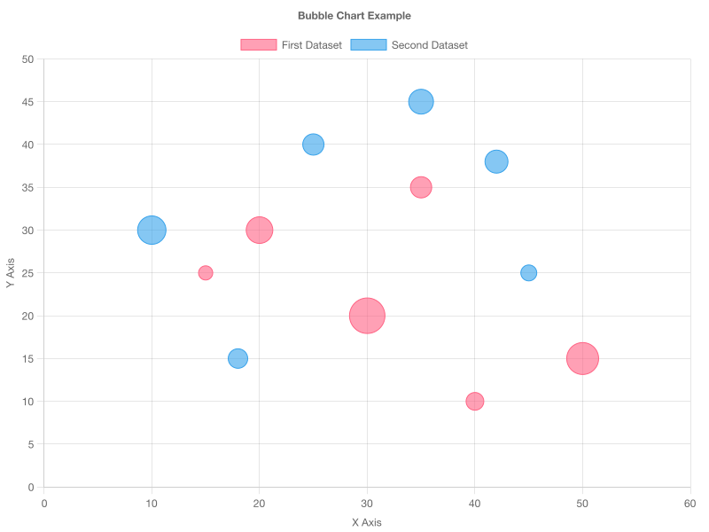
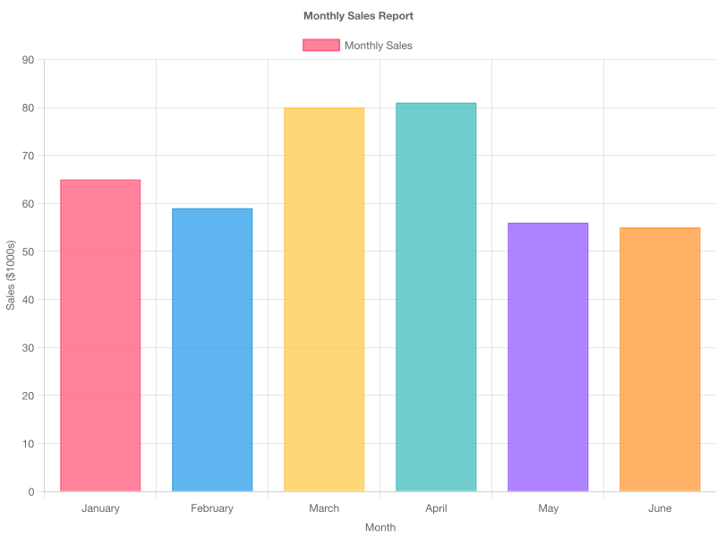
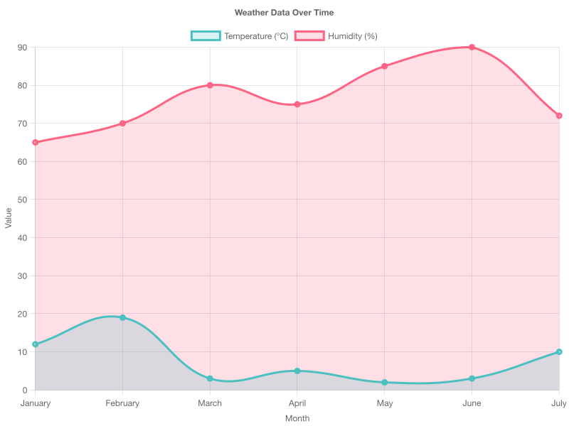
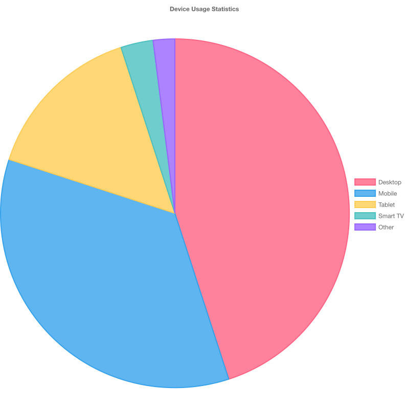
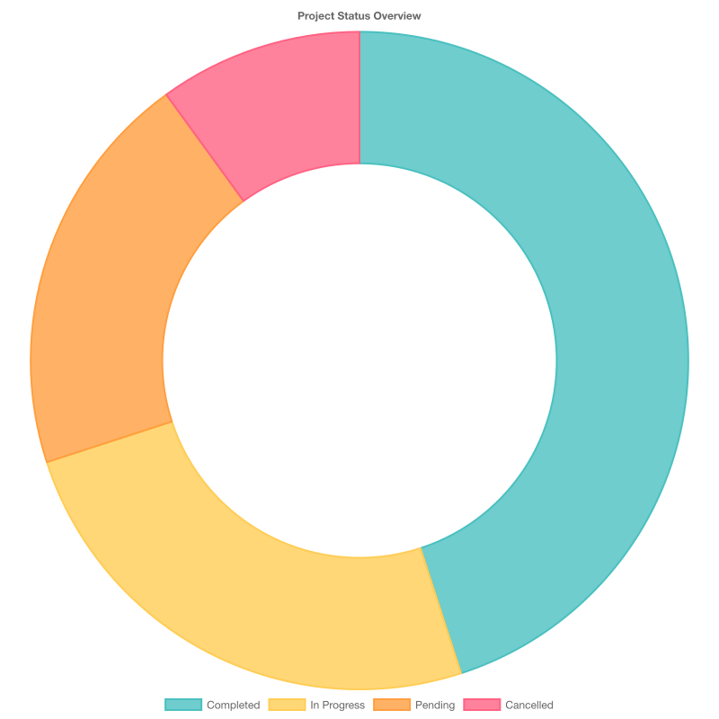
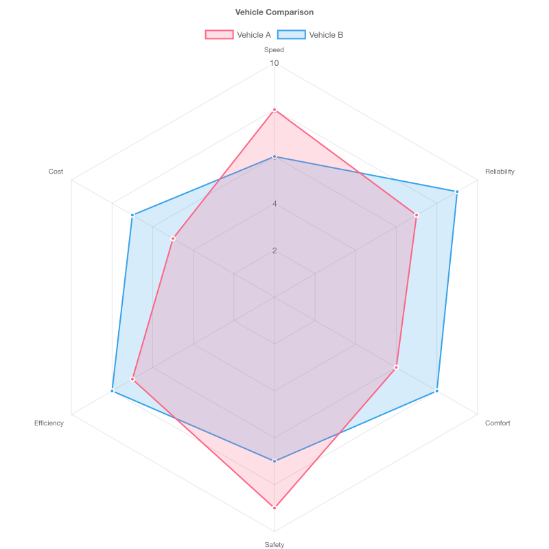
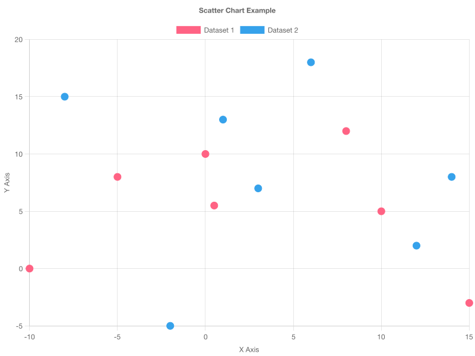
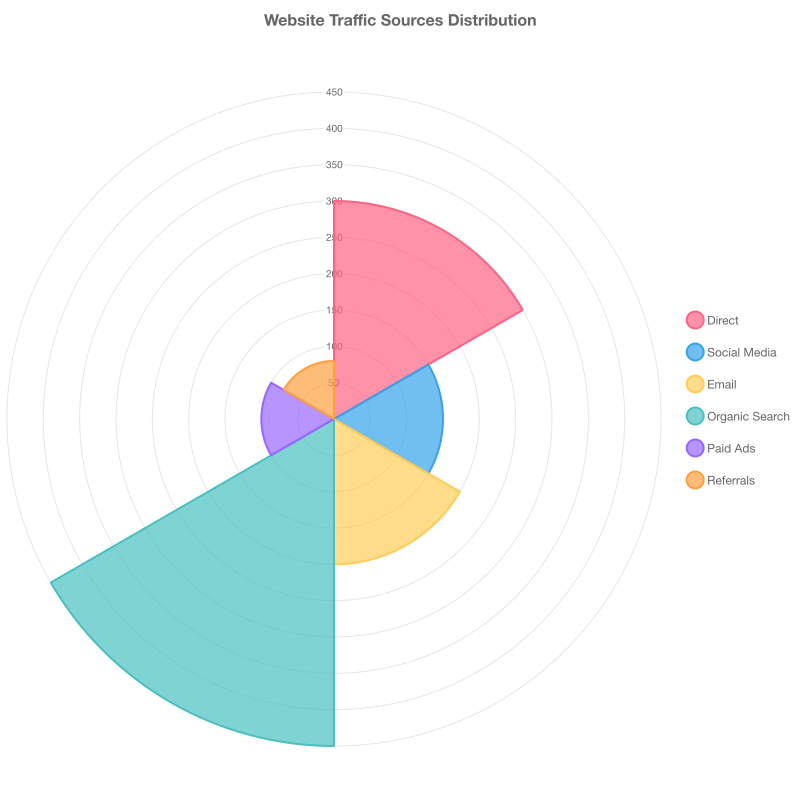

# Chart.js MCP Server

A Model Context Protocol (MCP) server that generates beautiful charts using Chart.js v4. Perfect for data visualization in Claude Desktop, Cursor, and other MCP-compatible applications.


*Just ask "Create a bubble chart showing company performance" and get professional results instantly!*

## 🎯 What This Does

Transform your data into beautiful, professional charts instantly! This MCP server connects to your favorite AI applications and generates:

- 📊 **Bar Charts** - Perfect for comparing categories
- 📈 **Line Charts** - Great for showing trends over time  
- 🥧 **Pie & Doughnut Charts** - Ideal for showing proportions
- 🎯 **Scatter & Bubble Charts** - Perfect for correlation analysis
- 🕸️ **Radar Charts** - Great for multi-dimensional comparisons
- 🌟 **Polar Area Charts** - Beautiful radial visualizations

All charts are generated as high-quality PNG images (800x600px) that you can save, share, or embed anywhere.

### 🖼️ See It In Action

Here's what you can create with just a simple request:

<table>
<tr>
<td align="center" width="33%">
<br/>
<strong>Bar Chart</strong><br/>
<em>Perfect for comparisons</em>
</td>
<td align="center" width="33%">
<br/>
<strong>Line Chart</strong><br/>
<em>Great for trends</em>
</td>
<td align="center" width="33%">
<br/>
<strong>Pie Chart</strong><br/>
<em>Show proportions</em>
</td>
</tr>
<tr>
<td align="center" width="33%">
<br/>
<strong>Doughnut Chart</strong><br/>
<em>Modern proportions</em>
</td>
<td align="center" width="33%">
<br/>
<strong>Radar Chart</strong><br/>
<em>Multi-dimensional data</em>
</td>
<td align="center" width="33%">
<br/>
<strong>Scatter Chart</strong><br/>
<em>Correlation analysis</em>
</td>
</tr>
<tr>
<td align="center" width="33%">
<br/>
<strong>Bubble Chart</strong><br/>
<em>3D relationships</em>
</td>
<td align="center" width="33%">
<br/>
<strong>Polar Area Chart</strong><br/>
<em>Radial visualizations</em>
</td>
<td align="center" width="33%">
<em>And more chart types<br/>coming soon!</em>
</td>
</tr>
</table>

---

## 🚀 For Users - Quick Setup

### System Requirements

- **Node.js 18+** - Required for running the MCP server
- **Build tools** - For compiling Canvas native dependencies:
  - **macOS**: Xcode Command Line Tools (`xcode-select --install`)
  - **Windows**: Visual Studio Build Tools or similar
  - **Linux**: build-essential package

### Easy NPM Installation (Recommended)

The simplest way to use this MCP server:

1. **Configure Claude Desktop**
   
   Add this to your Claude Desktop configuration file:
   
   **macOS**: `~/Library/Application Support/Claude/claude_desktop_config.json`
   **Windows**: `%APPDATA%/Claude/claude_desktop_config.json`
   
   ```json
   {
     "mcpServers": {
       "chartjs": {
         "command": "npx",
         "args": ["-y", "@ax-crew/chartjs-mcp-server"]
       }
     }
   }
   ```

2. **Restart Claude Desktop**

3. **Start Creating Charts!**
   
   Try asking Claude:
   ```
   "Create a bar chart showing sales data: Q1: $50k, Q2: $75k, Q3: $60k, Q4: $90k"
   ```

### Using with Cursor

Add to your Cursor settings or workspace configuration:
```json
{
  "mcp.servers": {
    "chartjs": {
      "command": "npx",
      "args": ["-y", "@ax-crew/chartjs-mcp-server"]
    }
  }
}
```

### Alternative: Install from Source

If you prefer to install from source or want to contribute:

1. **Clone and Build**
   ```bash
   git clone https://github.com/ax-crew/chartjs-mcp-server.git
   cd chartjs-mcp-server
   npm install && npm run build
   ```

2. **Configure with Local Path**
   
   ```json
   {
     "mcpServers": {
       "chartjs": {
         "command": "node",
         "args": ["/full/path/to/chartjs-mcp-server/dist/index.js"]
       }
     }
   }
   ```
   
   Replace `/full/path/to/chartjs-mcp-server` with the actual path where you cloned the repository.

---

## 📖 How to Use

### Basic Usage

Once configured, you can ask your AI assistant to create charts using natural language:

- *"Create a pie chart of my budget: Housing 40%, Food 25%, Transport 15%, Entertainment 20%"*
- *"Make a line chart showing website visitors over 6 months: Jan 1000, Feb 1200, Mar 1500, Apr 1300, May 1800, Jun 2100"*
- *"Generate a bar chart comparing programming languages: JavaScript 65%, Python 45%, Java 35%, Go 25%"*

### Chart Types Available

| Chart Type | Best For | Example Use Case |
|------------|----------|------------------|
| **Bar** | Comparing categories | Sales by region, survey results |
| **Line** | Trends over time | Stock prices, website traffic |
| **Pie** | Parts of a whole | Budget breakdown, market share |
| **Doughnut** | Proportions with focus | Same as pie, but more modern look |
| **Scatter** | Correlation analysis | Height vs weight, sales vs advertising |
| **Bubble** | 3D relationships | Revenue vs profit vs company size |
| **Radar** | Multi-factor comparison | Skill assessments, product features |
| **Polar Area** | Radial data | Seasonal data, directional analysis |

### Advanced Features

- 🎨 **Custom Colors**: Specify color schemes for your brand
- 📊 **Multiple Datasets**: Compare multiple data series
- 🏷️ **Labels & Titles**: Add context with custom labels
- 📱 **Responsive**: Charts work great at any size
- 🎛️ **Chart.js Options**: Full access to Chart.js v4 features

---

## 🛠️ Troubleshooting

### Common Issues

**Chart not generating?**
- Check that the MCP server is properly configured in your client
- Verify the server is running: `ps aux | grep chartjs`
- Try restarting your MCP client (Claude Desktop, Cursor, etc.)

**Configuration not working?**
- Check JSON syntax in your config file
- Ensure file paths are correct
- Check file permissions

**Charts look wrong?**
- Verify your data format matches Chart.js requirements
- Check for missing required fields (labels, datasets, etc.)
- Try a simpler chart first to test the connection

### Getting Help

1. **Check the [examples](./examples/)** - See working chart configurations
2. **Run tests** - `npm test` to verify everything works
3. **Check logs** - Look for error messages in your MCP client
4. **Open an issue** - We're here to help!

---

## 🔧 For Developers - Contributing

Want to improve this MCP server? We welcome contributions!

### Development Setup

```bash
# Clone and setup
git clone https://github.com/ax-crew/chartjs-mcp-server.git
cd chartjs-mcp-server
npm install

# Development workflow
npm run dev          # Watch mode for development
npm test            # Run tests
npm run build       # Build for production
npm run test:watch  # Test in watch mode
```

### Project Structure

```
chartjs-mcp-server/
├── src/
│   ├── index.ts           # Main MCP server implementation
│   └── chart-schema.json  # Chart.js v4 validation schema
├── examples/              # Example configurations & outputs
│   ├── *.json            # Chart configuration examples
│   ├── *.png             # Generated chart images
│   └── README.md         # Developer examples guide
├── test/
│   └── chart-server.test.js # Comprehensive test suite
├── package.json          # Dependencies and scripts
└── tsconfig.json         # TypeScript configuration
```

### Key Technologies

- **TypeScript** - Type-safe development
- **Chart.js v4** - Chart generation engine
- **Node Canvas** - Server-side rendering
- **MCP Protocol** - Model Context Protocol implementation
- **Node.js Test Runner** - Native testing (no external deps)

### Testing

We have comprehensive testing to ensure reliability:

```bash
npm test                  # 24 tests across 9 suites
npm run test:integration  # CLI-based integration tests
npm run test:watch        # Development watch mode
```

### Adding New Features

1. **Add chart type support** in `src/index.ts`
2. **Create example configuration** in `examples/`
3. **Add tests** in `test/chart-server.test.js`
4. **Update documentation** in both READMEs
5. **Submit a pull request**

### Code Standards

- ✅ TypeScript with strict mode
- ✅ Comprehensive error handling
- ✅ Test coverage for all features
- ✅ Clear, documented code
- ✅ MCP protocol compliance

---

## 📋 API Reference

### MCP Tool: `generateChart`

The server exposes one primary tool for chart generation:

**Parameters:**
- `chartConfig` (object) - Complete Chart.js v4 configuration
- `outputPath` (string, optional) - Custom output file path

**Returns:**
- Success: `{ success: true, outputPath: string, message: string }`
- Error: `{ success: false, error: string, message: string }`

**Example:**
```json
{
  "type": "bar",
  "data": {
    "labels": ["Q1", "Q2", "Q3", "Q4"],
    "datasets": [{
      "label": "Sales",
      "data": [50000, 75000, 60000, 90000],
      "backgroundColor": "rgba(54, 162, 235, 0.8)"
    }]
  },
  "options": {
    "responsive": true,
    "plugins": {
      "title": {
        "display": true,
        "text": "Quarterly Sales"
      }
    }
  }
}
```

---

## 📦 What's Included

- ✅ **Complete MCP Server** - Ready to use with any MCP client
- ✅ **8 Chart Types** - All major Chart.js chart types supported
- ✅ **Example Configurations** - 8 working examples in `/examples`
- ✅ **Visual References** - Generated PNG samples for each chart type
- ✅ **Comprehensive Tests** - 24 tests ensuring reliability
- ✅ **TypeScript Support** - Full type safety and IDE support
- ✅ **Error Handling** - Graceful error handling and validation
- ✅ **Documentation** - Complete setup and usage guides

---

## 🔗 Resources

- 📚 [Chart.js Documentation](https://www.chartjs.org/docs/latest/)
- 🔌 [Model Context Protocol](https://modelcontextprotocol.io/)
- 🎨 [Example Charts](./examples/) - See all supported chart types
- 🐛 [Issue Tracker](https://github.com/ax-crew/chartjs-mcp-server/issues)
- 💬 [Discussions](https://github.com/ax-crew/chartjs-mcp-server/discussions)

---

## 📄 License

MIT License - feel free to use this in your projects!

---

## 🌟 Star This Repo!

If this MCP server helps you create amazing charts, please give it a star ⭐ to help others discover it!

**Made with ❤️ for the MCP community** 